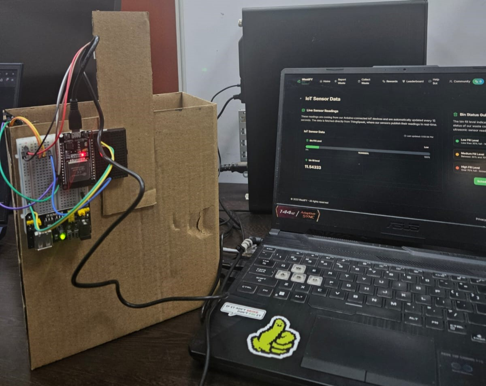

# WastiFY

WastiFY is a blockchain-integrated waste management platform that allows users to report waste locations and interact with the system via smart contracts. This repository contains the core codebase for the frontend and backend, along with smart contract implementations.

## Hosted Version

WastiFY is live at: [Wastexchange.co](https://Wastexchange.co)

## IoT Demonstration

Below is an image demonstrating the IoT setup used in WastiFY:




## Repository Structure

```
WastiFY/
│── backend/          # Backend server code
│── contracts/        # Solidity smart contracts
│── frontend/         # Next.js frontend
│── scripts/         # Deployment and interaction scripts
│── test/            # Smart contract tests
│── package.json     # Project dependencies
```

## Technologies Used

- **Next.js** - Frontend framework
- **Tailwind CSS** - Styling
- **Solidity** - Smart contract development
- **Ethers.js** - Blockchain interactions
- **Web3Auth** - Decentralized authentication

## Installation & Setup

### Prerequisites
- Node.js (>= 16.x)
- Metamask (or another Web3 provider)

### Steps
1. **Clone the repository**:
   ```sh
   git clone (https://github.com/himanshu-2l/WASTIFY)
   cd WastiFY
   ```

2. **Install dependencies**:
   ```sh
   yarn install
   ```

3. **Run the Project**:
   ```
   npm run dev
   ```
   The site should be accessible at `http://localhost:3000`

## Environment Variables
Create a `.env` file in the root directory and add necessary environment variables.

## Contributing

1. Fork the repository
2. Create a feature branch (`git checkout -b feature-branch`)
3. Commit changes (`git commit -m "Description"`)
4. Push to branch (`git push origin feature-branch`)
5. Open a pull request

## Contact
For issues, open a GitHub issue or reach out via discussions.

